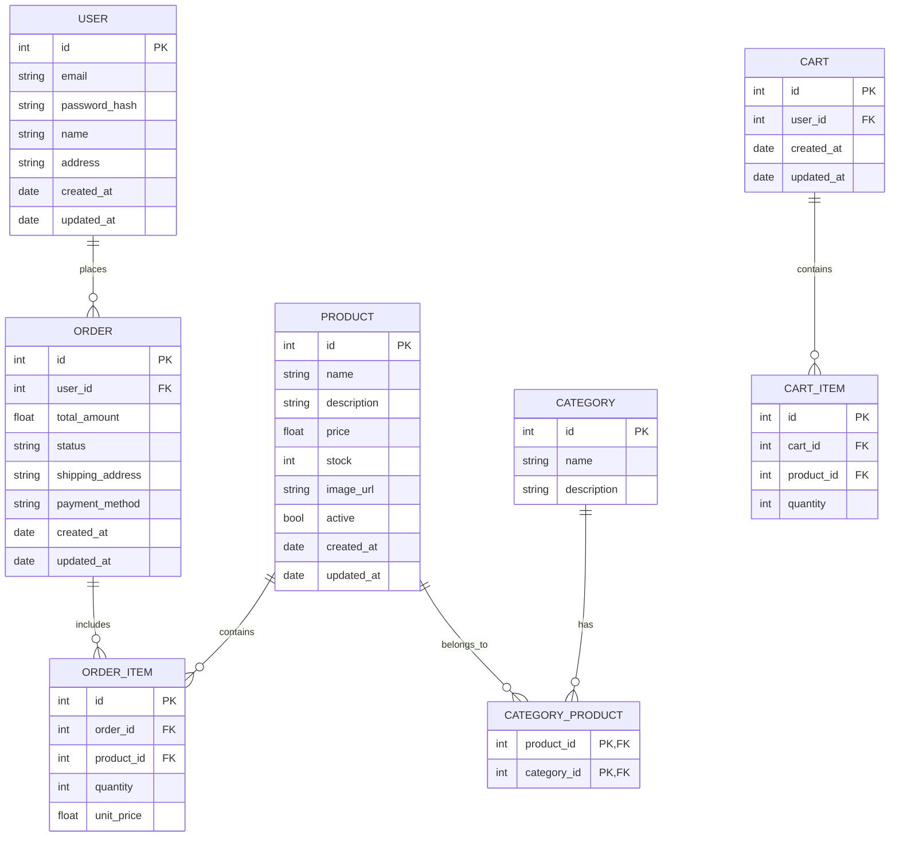

# Design Document - Projeto E-commerce

## Visão Geral

Este documento descreve o design e a arquitetura do projeto de e-commerce. O objetivo é criar uma aplicação completa utilizando Next.JS, ShadCN, Tailwind no Frontend e FastAPI no Backend, aplicando conceitos de orientação a objetos, arquitetura de software, design patterns, documentação, autenticação, Docker e DevOps.

## Requisitos Funcionais

* Cadastro de usuários
* Autenticação e autorização de usuários (JWT)
* Gerenciamento de produtos (CRUD)
* Carrinho de compras
* Processo de checkout
* Histórico de pedidos dos usuários
* Busca de produtos com filtros

## Requisitos Não Funcionais

* Performance: Respostas em menos de 500ms para a maioria das requisições.
* Segurança: Autenticação JWT e proteção contra CSRF.
* Escalabilidade: Uso de Docker e suporte a múltiplas instâncias.
* Manutenibilidade: Código organizado em módulos e bem documentado.

## Tecnologias Utilizadas

### Frontend

* Next.JS com React
* ShadCN para componentes estilizados
* Tailwind CSS para design responsivo
* Zustand para gerenciamento de estado
* SWR para cache de dados

### Backend

* FastAPI com Python
* SQLAlchemy + Alembic para ORM e migrações
* PostgreSQL como banco de dados principal
* Redis para cache
* Celery com RabbitMQ para tarefas assíncronas

### Infraestrutura e DevOps

* Docker e Docker Compose para containerização
* GitHub Actions para CI/CD
* Nginx como proxy reverso
* AWS S3 para armazenamento de imagens
* Elasticsearch para busca avançada

## Arquitetura do Sistema

* Frontend em Next.JS consumindo a API do FastAPI
* Backend em FastAPI com separação clara de responsabilidades (usuários, produtos, pedidos)
* Banco de dados PostgreSQL gerenciado por Docker
* Redis para cache de produtos
* Celery para tarefas assíncronas (envio de emails)
* Nginx para proxy reverso

## Design Patterns Aplicados

* Repository Pattern para lidar com banco de dados
* Singleton Pattern para conexões de Redis
* Observer Pattern para eventos assíncronos com Celery

## Segurança

* Autenticação JWT
* OAuth 2.0 com Google/Facebook
* Proteção CSRF
* Rate Limiting no Backend

## Documentação e Boas Práticas

* Docstrings em todos os métodos e classes
* Swagger gerado automaticamente pelo FastAPI
* Comentários claros em trechos complexos de código
* Uso de Git com mensagens claras e commits atômicos

## Modelagem de Dados

### Principais Entidades e Relacionamentos

### Descrição das Entidades

* **User**: Armazena informações dos usuários registrados
* **Product**: Catálogo de produtos disponíveis
* **Category**: Categorias para organização dos produtos
* **Order**: Pedidos realizados pelos usuários
* **OrderItem**: Itens individuais de cada pedido
* **Cart**: Carrinho de compras temporário
* **CartItem**: Itens adicionados ao carrinho

## Estratégia de Testes

### Testes Unitários

* Frontend: Jest e React Testing Library para componentes React
* Backend: Pytest para testar funções e classes isoladamente
* Cobertura mínima de 80% para o código de negócio

### Testes de Integração

* Testes de API com Pytest e TestClient do FastAPI
* Testes de integração frontend-backend com Cypress
* Testes de integração com banco de dados usando containers Docker

### Testes E2E

* Cypress para fluxos completos de usuário
* Cenários críticos: registro, login, compra, checkout
* Testes automatizados em ambiente de staging via GitHub Actions

## User Stories / Casos de Uso

### Como cliente não autenticado

* **Navegação:** Posso navegar pelo catálogo de produtos sem me cadastrar
* **Busca:** Posso buscar produtos por nome, categoria e outros filtros
* **Carrinho:** Posso adicionar produtos ao carrinho temporário
* **Cadastro:** Posso me cadastrar fornecendo informações básicas

### Como cliente autenticado

* **Login:** Posso fazer login com email/senha ou via Google/Facebook
* **Perfil:** Posso visualizar e editar meus dados pessoais
* **Carrinho Persistente:** Meu carrinho é salvo entre sessões
* **Checkout:** Posso finalizar uma compra informando endereço e forma de pagamento
* **Histórico:** Posso consultar meus pedidos anteriores e seu status

### Como administrador

* **Gestão de Produtos:** Posso adicionar, editar ou remover produtos
* **Gestão de Categorias:** Posso criar e organizar categorias
* **Gestão de Pedidos:** Posso visualizar e atualizar o status de pedidos
* **Relatórios:** Posso gerar relatórios de vendas e estoque

## Monitoramento e Observabilidade

### Ferramentas de Monitoramento

* **Prometheus:** Coleta de métricas de performance e uso
* **Grafana:** Dashboards para visualização de métricas
* **Sentry:** Rastreamento de erros em tempo real
* **ELK Stack:** Coleta e análise de logs (Elasticsearch, Logstash, Kibana)

### Métricas Chave

* Tempo de resposta das APIs
* Taxa de erro por endpoint
* Uso de recursos (CPU, memória, disco)
* Contagem de usuários ativos e sessões
* Conversão de visitantes em compradores

### Alertas

* Alertas automáticos para endpoints lentos (>500ms)
* Notificações para erros críticos via Slack/Email
* Monitoramento de disponibilidade com health checks

## Roadmap de Desenvolvimento

### Fase 1: MVP (8 semanas)

* Configuração da infraestrutura básica
* Implementação do cadastro e autenticação
* Catálogo de produtos com busca simples
* Carrinho de compras básico
* Checkout simplificado

### Fase 2: Recursos Essenciais (6 semanas)

* Integração com gateways de pagamento
* Sistema de avaliações de produtos
* Histórico detalhado de pedidos
* Perfil de usuário completo
* Melhorias na busca com filtros avançados

### Fase 3: Otimização e Escalabilidade (4 semanas)

* Implementação de cache com Redis
* Otimização de performance
* Melhorias na experiência de usuário
* Testes de carga e estresse

### Fase 4: Recursos Avançados (6 semanas)

* Recomendações personalizadas
* Sistema de cupons e promoções
* Programa de fidelidade
* Dashboard administrativo avançado

## UI/UX Design

### Wireframes e Mockups

* [Link para designs no Figma](https://figma.com/file/example)
* Os wireframes incluem:
  * Página inicial
  * Página de detalhes do produto
  * Carrinho de compras
  * Processo de checkout
  * Perfil do usuário
  * Painel administrativo

### Guia de Estilo

* Paleta de cores: #3B82F6 (primária), #1F2937 (secundária), #F9FAFB (background)
* Tipografia: Inter para textos, Montserrat para títulos
* Componentes: Utilização dos componentes do ShadCN com personalizações
* Responsividade: Breakpoints em 640px, 768px, 1024px, 1280px
