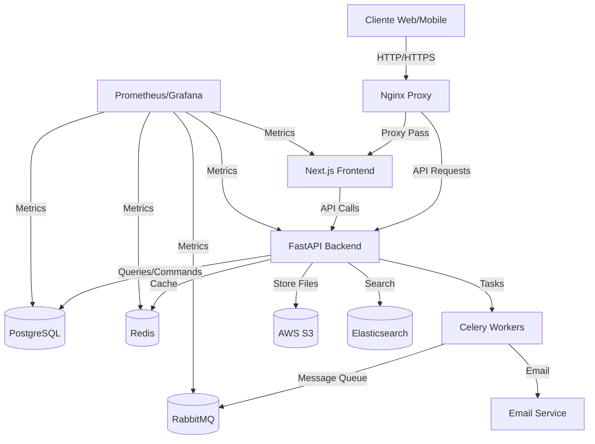
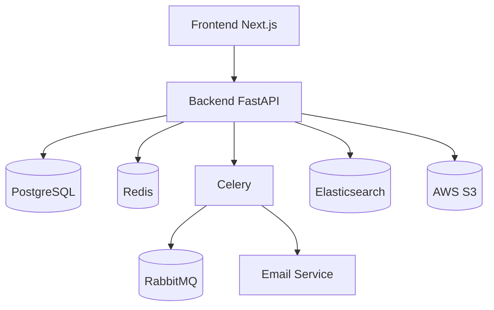

# Arquitetura Detalhada

## Visão Geral da Arquitetura



## Componentes da Arquitetura

### Frontend (Next.js)

O frontend segue uma arquitetura baseada em componentes com os seguintes módulos:

- **Páginas**: Implementadas usando o sistema de roteamento do Next.js
- **Componentes**: Componentes reutilizáveis e customizados com ShadCN
- **Hooks**: Custom hooks para gerenciar estado e lógica reutilizável
- **Services**: Funções para comunicação com a API
- **Utils**: Funções utilitárias
- **Contexts**: Contextos React para estado global como autenticação e carrinho

#### Estrutura de Diretórios Frontend

```bash
frontend/
├── app/             # Pages Router do Next.js 13+
├── components/      # Componentes UI reutilizáveis
│   ├── ui/          # Componentes básicos (ShadCN)
│   ├── forms/       # Componentes de formulário
│   ├── layout/      # Componentes de layout
│   └── products/    # Componentes relacionados a produtos
├── lib/             # Utilitários e helpers
├── hooks/           # Custom hooks
├── services/        # Serviços de API
├── store/           # Estado global com Zustand
└── public/          # Arquivos estáticos
```

### Backend (FastAPI)

O backend segue uma arquitetura limpa (Clean Architecture) com:

- **API**: Endpoints FastAPI organizados por domínio
- **Domain**: Modelos e regras de negócio
- **Repository**: Acesso a dados
- **Services**: Lógica de negócios
- **Infrastructure**: Configuração e integrações externas

#### Estrutura de Diretórios Backend

```bash
backend/
├── app/
│   ├── api/             # Endpoints FastAPI
│   │   ├── deps.py      # Dependências (injeção)
│   │   ├── errors.py    # Manipulação de erros
│   │   └── routes/      # Rotas agrupadas por domínio
│   ├── core/            # Núcleo da aplicação
│   │   ├── config.py    # Configurações
│   │   └── security.py  # Autenticação e segurança
│   ├── db/              # Conexão com banco de dados
│   │   ├── base.py      # Classe base para modelos
│   │   └── session.py   # Sessões SQLAlchemy
│   ├── models/          # Modelos SQLAlchemy
│   ├── schemas/         # Schemas Pydantic
│   ├── services/        # Lógica de negócio
│   └── repositories/    # Acesso a dados
├── migrations/          # Migrações Alembic
└── tests/               # Testes automatizados
```

## Fluxo de Dados

### Cadastro de Usuário

1. Cliente envia dados de registro para `/api/v1/users/register`
2. API valida os dados com Pydantic schemas
3. Service verifica se o email já existe
4. Repository salva o usuário no PostgreSQL
5. API retorna os dados do usuário criado
6. Task assíncrona via Celery envia email de boas-vindas

### Processo de Compra

1. Usuário adiciona produtos ao carrinho
2. Frontend armazena o carrinho no localStorage e/ou backend
3. No checkout, frontend envia dados para `/api/v1/orders`
4. Backend valida disponibilidade de estoque
5. Backend cria o pedido no banco de dados
6. Backend inicia processamento de pagamento (gateway)
7. Após confirmação, backend atualiza status do pedido
8. Celery envia email de confirmação do pedido

## Dependências Entre Serviços



## Considerações de Escalabilidade

- **Stateless**: Aplicação backend stateless permitindo escalar horizontalmente
- **Caching**: Redis para cache de produtos, categorias e resultados de busca
- **CDN**: Conteúdo estático entregue via CDN
- **Containers**: Arquitetura containerizada para fácil replicação
- **Microserviços**: Potencial para extrair funcionalidades como pagamentos em serviços separados no futuro
